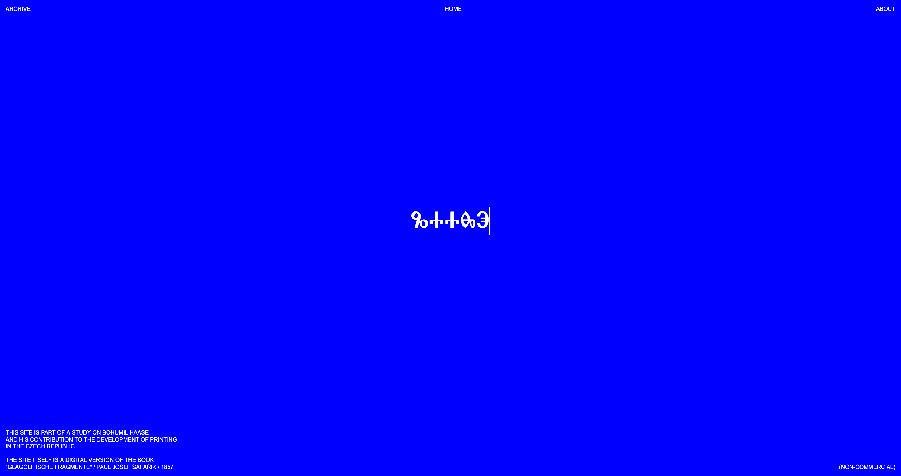

# Glagolitische Fragmente

### Preview

A web-based digitalization and typographic interpretation of the historical book *"Glagolitische Fragmente"* (1857) by Karl Adolph Constantin Höfler and Paul Joseph Šafařík.

Developed as part of the **Clausura (Winter Semester)** project at the **[AAAD / UMPRUM](https://www.umprum.cz/) Studio of Typography**.

🔗 **[View Live Website](https://yunglordsimens.github.io/haase/)**

---

## About the Project

This project explores the digital translation of historical Glagolitic scripts and texts. It combines modern web technologies with custom type design to reimagine the original manuscript for a digital context.

**Date:** January 2023

## Credits

| Role | Name |
| :--- | :--- |
| **Art Direction** | Maria Chernobay |
| **Development** | Oleksandr Hohulia |
| **Custom Fonts** | Maria Chernobay, Anna Ivakhno, Viktoria Naumuk |

## Typography

The website features custom typefaces designed specifically for this digitalization project, focusing on the historical accuracy and aesthetic of the Glagolitic script within a contemporary layout.

## Tech Stack

* HTML5 / CSS3
* JavaScript
* GitHub Pages

